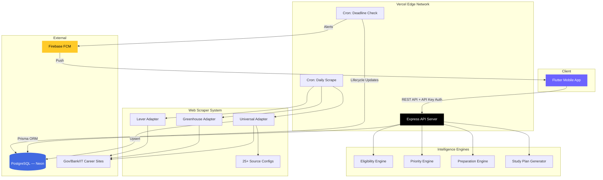
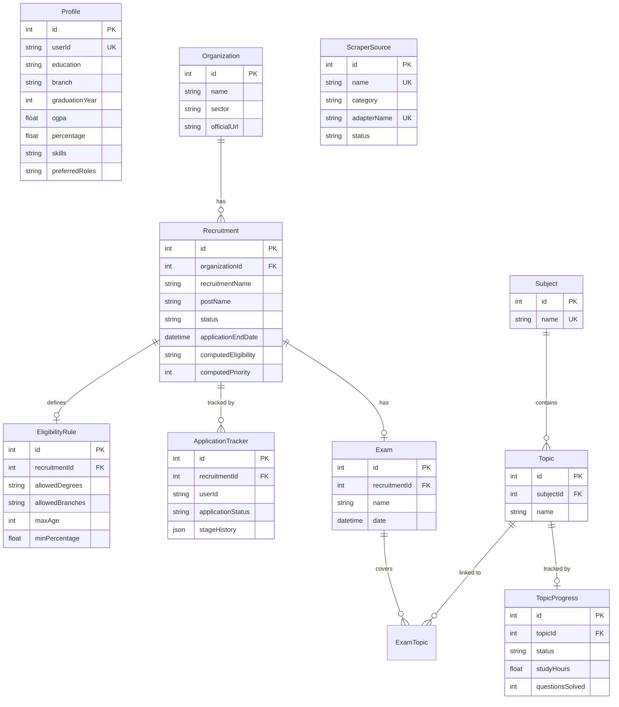

<p align="center">
  <h1 align="center">✦ Stella Backend</h1>
  <p align="center">
    <strong>AI-Powered Career Opportunity Intelligence Engine</strong>
  </p>
  <p align="center">
    <em>Scrapes 25+ recruitment sources • Computes eligibility & priority scores • Sends real-time push notifications</em>
  </p>
</p>

<p align="center">
  
  
  
  
  
  
</p>

<p align="center">
  
  
</p>

---

## ⚡ What is Stella?

**Stella** is an intelligent career command center that aggregates recruitment opportunities from government bodies, banks, PSUs, and top IT companies — then ranks them by how well they match *your* profile.

Instead of manually checking dozens of websites every day, Stella does it for you — and tells you exactly which opportunities you're eligible for, which are closing soon, and what to study next.

> 🎯 **Built for**: Fresh graduates and job seekers preparing for competitive exams and IT placements in India.

---

## ✨ Key Features

| Feature | Description |
|---------|-------------|
| 🕷️ **Smart Web Scraping** | Automated scrapers for 25+ recruitment sources — UPSC, SSC, IBPS, ISRO, TCS, Infosys, Google, and more |
| 🧠 **Eligibility Engine** | Real-time eligibility computation based on your degree, branch, age, percentage, and experience |
| 📊 **Priority Scoring** | Multi-factor priority algorithm considering deadline urgency, skill match, salary, and role preferences |
| 📚 **Preparation Tracker** | Subject-wise syllabus tracking with topic progress, daily study plans, and exam readiness scores |
| 🔔 **Push Notifications** | Firebase Cloud Messaging for new opportunities, deadline alerts, and recruitment updates |
| 📋 **Application Pipeline** | Full application lifecycle tracking — from SAVED → APPLIED → INTERVIEW → SELECTED |

---

## 🏗️ System Architecture



---

## 🛠️ Tech Stack

| Layer | Technology | Purpose |
|-------|-----------|---------|
| **Runtime** | Node.js 18+ | JavaScript server runtime |
| **Framework** | Express 5 | HTTP server and routing |
| **ORM** | Prisma 7 | Type-safe database access and migrations |
| **Database** | PostgreSQL (Neon) | Serverless Postgres with connection pooling |
| **Auth** | API Key + Firebase Admin | Client authentication and user identity |
| **Notifications** | Firebase Cloud Messaging | Real-time push notifications to mobile |
| **Scraping** | Cheerio + Axios + JSDOM | HTML parsing and HTTP requests |
| **PDF Parsing** | pdf-parse | Extract recruitment data from PDF notifications |
| **Scheduling** | node-cron / Vercel Crons | Automated daily scraping and deadline checks |
| **Deployment** | Vercel (Serverless) | Zero-config deployment with edge functions |
| **Rate Limiting** | Custom middleware | 120 req/min per IP sliding window |

---

## 📡 API Reference

All endpoints are prefixed with `/api` and require an `x-api-key` header (except `/health` and `/cron/*`).

### Core Endpoints

| Method | Endpoint | Description |
|--------|----------|-------------|
| `GET` | `/health` | Health check — returns server status |
| `GET` | `/dashboard` | Dashboard summary with high-priority opportunities, deadlines, and preparation stats |
| `GET` | `/search?q=...` | Global search across recruitments, organizations, and subjects |

### Profile

| Method | Endpoint | Description |
|--------|----------|-------------|
| `GET` | `/profile` | Get user profile (auto-creates if missing) |
| `PUT` | `/profile` | Update profile fields (education, branch, skills, etc.) |

### Opportunities

| Method | Endpoint | Description |
|--------|----------|-------------|
| `GET` | `/opportunities` | List all opportunities with computed eligibility, priority, and readiness scores |
| `GET` | `/opportunities/:id` | Get single opportunity with full details |

> **Query Filters**: `sector`, `eligibility`, `minSalary`, `status`, `search`, `sort` (`deadline` \| `salary` \| `priority`), `jobType`

### Applications

| Method | Endpoint | Description |
|--------|----------|-------------|
| `GET` | `/applications` | List user's tracked applications |
| `POST` | `/applications` | Create/update application tracker |
| `PUT` | `/applications/:recruitmentId` | Update application status with stage history |

> **Application Stages**: `SAVED` → `PLANNING` → `APPLIED` → `ASSESSMENT_PENDING` → `ASSESSMENT_COMPLETED` → `INTERVIEW_SCHEDULED` → `TECHNICAL_INTERVIEW` → `HR_INTERVIEW` → `SELECTED` / `REJECTED` / `WITHDRAWN`

### Preparation

| Method | Endpoint | Description |
|--------|----------|-------------|
| `GET` | `/syllabus` | Get all subjects with topics, progress, and linked exams |
| `PUT` | `/preparation/topics/:id` | Update topic progress (status, study hours, questions solved) |
| `GET` | `/preparation/daily-plan` | Get AI-generated daily study plan |
| `PUT` | `/preparation/tasks/:id` | Mark daily task as completed |

### Sources & Scrapers

| Method | Endpoint | Description |
|--------|----------|-------------|
| `GET` | `/sources` | Get scraper source statuses and health |
| `POST` | `/cron/scrape` | Trigger batch scraping (cron-authenticated) |
| `POST` | `/cron/deadline-check` | Trigger deadline lifecycle processing (cron-authenticated) |

---

## 🗄️ Database Schema



---

## 🧠 Intelligence Engines

### Eligibility Engine
Evaluates a user's profile against recruitment rules in real-time:
- **Degree & Branch matching** — supports wildcard "any" and partial matching
- **Age validation** — computes from DOB against min/max age limits
- **Percentage threshold** — checks against minimum percentage requirements
- **Experience check** — validates years of experience
- **Graduation cutoff** — handles final-year candidate allowances
- Returns a structured result with `ELIGIBLE` | `NOT_ELIGIBLE` | `UNKNOWN` status and per-field reasons

### Priority Engine
Scores opportunities 0–100 using multiple weighted factors:
- Eligibility status (+35 if eligible)
- Deadline urgency (+25 if ≤3 days, +15 if ≤14 days)
- Skill match (up to +15 based on keyword overlap)
- Role preference match (+10)
- Salary preference match (+10)
- Verification status (+5 if officially verified)

### Preparation Engine
Calculates exam readiness from topic progress:
- Weighted by exam topic importance
- Tracks study hours, questions solved, and accuracy per topic
- Feeds into the daily study plan generator

---

## 🕷️ Scraper System

The scraper uses an **adapter pattern** to support 25+ recruitment sources:

| Category | Sources |
|----------|---------|
| **Government** | UPSC, SSC, TNPSC, ISRO, DRDO, NIC, NIELIT, RRB |
| **Banking** | IBPS, SBI, RBI, NABARD |
| **PSU** | BEL, BHEL, HAL, ONGC, NTPC, IOCL, GAIL, PowerGrid |
| **Private IT** | TCS, Infosys, Wipro, HCLTech, Cognizant, Accenture, Zoho, Freshworks, LTIMindtree, Capgemini |
| **Big Tech** | Google, Microsoft, Amazon, Oracle, IBM |

Each source uses either a **specialized adapter** (Greenhouse, Lever) or the **Universal Adapter** with per-source CSS selectors configured in `scraperConfig.json`.

---

## 📁 Project Structure

```
stella-backend/
├── api/
│   └── index.js              # Vercel serverless entry point
├── src/
│   ├── index.js               # Express app — all routes and middleware
│   ├── cron.js                # Local cron job scheduler
│   ├── lib/
│   │   └── prisma.js          # Prisma client singleton
│   ├── routes/
│   │   └── sources.js         # Scraper source management routes
│   ├── services/
│   │   ├── eligibilityEngine.js    # Profile-vs-rule eligibility checker
│   │   ├── priorityEngine.js       # Multi-factor opportunity scorer
│   │   ├── preparationEngine.js    # Exam readiness calculator
│   │   ├── studyPlanGenerator.js   # Daily study plan AI
│   │   ├── notificationService.js  # Firebase FCM push notifications
│   │   └── opportunityLifecycle.js # Deadline status transitions
│   └── scrapers/
│       ├── UniversalAdapter.js     # Config-driven generic scraper
│       ├── GreenhouseAdapter.js    # Greenhouse ATS adapter
│       ├── LeverAdapter.js         # Lever ATS adapter
│       ├── baseAdapter.js          # Base adapter class
│       └── scraperConfig.json      # CSS selectors for 25+ sources
├── prisma/
│   ├── schema.prisma          # Database schema (10 models)
│   ├── migrations/            # Database migration history
│   └── seed.js                # Database seeding script
├── test/
│   ├── eligibility.test.js    # Eligibility engine unit tests
│   ├── priority.test.js       # Priority engine unit tests
│   └── lifecycle.test.js      # Opportunity lifecycle tests
├── .env.example               # Environment variable template
├── .gitignore
├── package.json
├── vercel.json                # Vercel deployment + cron config
└── README.md
```

---

## 🚀 Getting Started

### Prerequisites

- **Node.js** 18+ ([download](https://nodejs.org/))
- **PostgreSQL** database ([Neon](https://neon.tech/) recommended for serverless)
- **Firebase** project (for push notifications — optional)

### Installation

```bash
# Clone the repository
git clone https://github.com/RuinPrince/stella-backend.git
cd stella-backend

# Install dependencies
npm install

# Set up environment variables
cp .env.example .env
# Edit .env with your database URL and secrets

# Run database migrations
npx prisma migrate deploy

# Seed the database (optional)
node prisma/seed.js

# Start development server
npm run dev
```

The server will start at `http://localhost:3000`.

### Quick Test

```bash
# Health check
curl http://localhost:3000/api/health

# Get dashboard (with auth)
curl -H "x-api-key: YOUR_API_KEY" http://localhost:3000/api/dashboard
```

---

## ☁️ Deployment

This project is deployed on **Vercel** with serverless functions and scheduled cron jobs.

```bash
# Install Vercel CLI
npm i -g vercel

# Deploy
vercel --prod
```

### Vercel Cron Jobs

| Schedule | Endpoint | Purpose |
|----------|----------|---------|
| `0 6 * * *` (6 AM daily) | `/api/cron/scrape` | Batch scrape recruitment sources |
| `0 9 * * *` (9 AM daily) | `/api/cron/deadline-check` | Update opportunity statuses and send deadline alerts |

---

## 🧪 Testing

```bash
# Run all tests
npm test

# Run with verification (lint + tests)
npm run verify
```

Tests cover:
- ✅ Eligibility engine — degree, branch, age, percentage, experience checks
- ✅ Priority engine — deadline urgency, skill matching, scoring
- ✅ Opportunity lifecycle — status transitions and deadline detection

---

## 🔐 Environment Variables

| Variable | Required | Description |
|----------|----------|-------------|
| `DATABASE_URL` | ✅ | PostgreSQL connection string |
| `CRON_SECRET` | ✅ | Secret to authenticate cron job requests |
| `API_KEY` | ✅ | API key for client authentication |
| `FIREBASE_SERVICE_ACCOUNT` | ❌ | Firebase Admin SDK JSON (enables push notifications) |
| `PORT` | ❌ | Server port (default: 3000) |

---

## 🤝 Related

- **[Stella Mobile](https://github.com/RuinPrince/stella-mobile)** — Flutter mobile app that powers the user-facing experience

---

## 📄 License

This project is licensed under the **MIT License** — see the [LICENSE](LICENSE) file for details.

---

<p align="center">
  <strong>Built with ❤️ by <a href="https://github.com/RuinPrince">Aravind Samy</a></strong>
</p>
